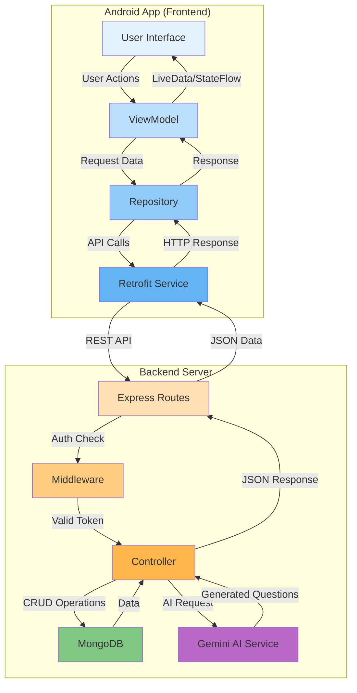

<div align="center">

# 🎓 CampusHelper

### Your Complete Academic Companion

[](https://www.android.com/)
[](https://kotlinlang.org/)
[](https://android-arsenal.com/api?level=24)
[](LICENSE)

**An intelligent educational platform for students featuring AI-powered practice tests, comprehensive progress tracking, and competitive exam preparation.**

[Features](#-features) • [Screenshots](#-screenshots) • [Tech Stack](#-tech-stack) • [Architecture](#-architecture) • [Installation](#-installation) • [API Documentation](#-api-documentation)

</div>

---

## 📱 Features

### 🎯 For Students

<table>
<tr>
<td width="50%">

#### 📚 **Study Materials Management**
- Browse subjects by category
- Access notes, videos, books, and practice materials
- Download and view resources offline
- Organized by semester and credits

</td>
<td width="50%">

#### 🧪 **AI-Powered Practice Tests**
- Topic-based test generation using Google Gemini AI
- Multiple choice questions with 4 options
- Real-time answer tracking
- Instant results and detailed scoring
- Test history and performance analysis

</td>
</tr>
<tr>
<td width="50%">

#### 📊 **Progress Analytics**
- Visual performance dashboards
- Subject-wise performance tracking (Bar charts)
- Overall accuracy metrics (Pie charts)
- Performance trend analysis (Line graphs)
- Study streak monitoring
- Average score calculations

</td>
<td width="50%">

#### 🏆 **Competitive Exam Preparation**
- Support for major exams:
  - 📘 JEE (Joint Entrance Examination)
  - 🏥 NEET (Medical Entrance)
  - 💼 CAT (Management)
  - 🏛️ UPSC (Civil Services)
  - 🎓 GATE (Engineering)
  - ⚔️ CDS & NDA (Defense)
- Custom question patterns per exam
- Category-based organization

</td>
</tr>
</table>

### 👨‍💼 For Admins

- **Content Management**: Upload and manage study materials
- **Subject Creation**: Add new subjects with details
- **Exam Management**: Configure competitive exam patterns
- **User Management**: Monitor student activities

---

## 🎨 Screenshots

<div align="center">

| Splash Screen | Login | Student Dashboard | Profile |
|:---:|:---:|:---:|:---:|
|  |  |  |  |

| Subjects | Practice Test | Progress Analytics | Competitive Exams |
|:---:|:---:|:---:|:---:|
|  |  |  |  |

</div>

---

## 🏗️ Architecture

### **MVVM Pattern**

```
┌─────────────────────────────────────────────────────────┐
│                         VIEW                            │
│  (Activities, Fragments, XML Layouts)                   │
│  • LoginActivity                                        │
│  • StudentDashboardActivity                             │
│  • PracticeTestActivity                                 │
│  • Fragments: Home, Progress, Exams, Profile            │
└──────────────────┬──────────────────────────────────────┘
                   │
                   │ observes LiveData/StateFlow
                   ▼
┌─────────────────────────────────────────────────────────┐
│                      VIEWMODEL                          │
│  (Business Logic, State Management)                     │
│  • AuthViewModel                                        │
│  • SubjectViewModel                                     │
│  • TestViewModel                                        │
│  • ProgressViewModel                                    │
└──────────────────┬──────────────────────────────────────┘
                   │
                   │ calls repository methods
                   ▼
┌─────────────────────────────────────────────────────────┐
│                     REPOSITORY                          │
│  (Data Management Layer)                                │
│  • AuthRepository                                       │
│  • SubjectRepository                                    │
│  • TestRepository                                       │
│  • ProgressRepository                                   │
└──────────────────┬──────────────────────────────────────┘
                   │
                   │ uses API service
                   ▼
┌─────────────────────────────────────────────────────────┐
│                    DATA SOURCE                          │
│  (Network Layer - Retrofit)                             │
│  • ApiService Interface                                 │
│  • Retrofit Client                                      │
│  • OkHttp Interceptors                                  │
└──────────────────┬──────────────────────────────────────┘
                   │
                   │ REST API calls
                   ▼
┌─────────────────────────────────────────────────────────┐
│                   BACKEND SERVER                        │
│  (Node.js + Express + MongoDB)                          │
└─────────────────────────────────────────────────────────┘
```

---

## 🔄 Data Flow Diagram



---

## 🛠️ Tech Stack

### **Frontend (Android)**

| Technology | Purpose | Version |
|------------|---------|---------|
|  | Primary Language | Latest |
|  | Platform | API 24+ |
|  | Architecture Components | Latest |
|  | UI Framework | 1.10.0 |
|  | REST API Client | 2.9.0 |
|  | Dependency Injection | 2.48 |
|  | Async Operations | 1.7.3 |
|  | Data Visualization | 3.1.0 |
|  | Image Loading | 4.15.1 |

### **Backend**

| Technology | Purpose |
|------------|---------|
|  | Runtime Environment |
|  | Web Framework |
|  | NoSQL Database |
|  | Authentication |
|  | AI Test Generation |

---

## 📦 Project Structure

```
CampusHelper2/
├── app/
│   ├── src/
│   │   ├── main/
│   │   │   ├── java/com/campushelper/app/
│   │   │   │   ├── data/
│   │   │   │   │   ├── model/          # Data classes (User, Subject, Test, etc.)
│   │   │   │   │   ├── remote/         # API service interfaces
│   │   │   │   │   └── repository/     # Repository implementations
│   │   │   │   ├── di/                 # Hilt modules
│   │   │   │   ├── ui/
│   │   │   │   │   ├── activity/       # Activities
│   │   │   │   │   ├── adapter/        # RecyclerView adapters
│   │   │   │   │   ├── auth/           # Login, Register
│   │   │   │   │   ├── student/        # Student dashboard & fragments
│   │   │   │   │   ├── admin/          # Admin panel
│   │   │   │   │   └── viewmodel/      # ViewModels
│   │   │   │   └── utils/              # Helper classes, constants
│   │   │   └── res/
│   │   │       ├── layout/             # XML layouts
│   │   │       ├── drawable/           # Images, vectors, gradients
│   │   │       ├── values/             # Colors, strings, themes
│   │   │       └── navigation/         # Navigation graphs
│   │   └── build.gradle                # App dependencies
│   └── build.gradle                    # Project configuration
└── gradle/                             # Gradle wrapper
```

---

## 🗄️ Database Schema

### **MongoDB Collections**

#### **Users Collection**
```json
{
  "_id": "ObjectId",
  "name": "String",
  "email": "String (unique)",
  "password": "String (hashed)",
  "role": "String (student/admin)",
  "profileImage": "String (URL)",
  "createdAt": "Date",
  "updatedAt": "Date"
}
```

#### **Subjects Collection**
```json
{
  "_id": "ObjectId",
  "name": "String",
  "code": "String (unique)",
  "description": "String",
  "category": "String",
  "semester": "Number",
  "credits": "Number",
  "createdBy": "ObjectId (ref: User)",
  "createdAt": "Date"
}
```

#### **Tests Collection**
```json
{
  "_id": "ObjectId",
  "userId": "ObjectId (ref: User)",
  "subjectId": "ObjectId (ref: Subject)",
  "topic": "String",
  "questions": [
    {
      "question": "String",
      "options": {
        "A": "String",
        "B": "String",
        "C": "String",
        "D": "String"
      },
      "correctAnswer": "String",
      "explanation": "String"
    }
  ],
  "userAnswers": ["Number"],
  "score": "Number",
  "totalQuestions": "Number",
  "completedAt": "Date"
}
```

#### **Progress Collection**
```json
{
  "_id": "ObjectId",
  "userId": "ObjectId (ref: User)",
  "totalTests": "Number",
  "averageScore": "Number",
  "subjectProgress": [
    {
      "subjectId": "ObjectId",
      "subjectName": "String",
      "testsAttempted": "Number",
      "averageScore": "Number"
    }
  ],
  "studyStreak": {
    "current": "Number",
    "longest": "Number"
  }
}
```

#### **Competitive Exams Collection**
```json
{
  "_id": "ObjectId",
  "name": "String",
  "shortName": "String",
  "description": "String",
  "category": "String",
  "subjects": ["String"],
  "questionPattern": {
    "totalQuestions": "Number",
    "duration": "Number",
    "difficulty": "String"
  }
}
```

---

## 🚀 Installation

### **Prerequisites**

- Android Studio Arctic Fox or newer
- JDK 11 or higher
- Android SDK API 24+
- Git

### **Steps**

1. **Clone the Repository**
   ```bash
   git clone https://github.com/YOUR_USERNAME/CampusHelper-Android.git
   cd CampusHelper-Android
   ```

2. **Open in Android Studio**
   - Open Android Studio
   - Select `File > Open`
   - Navigate to the cloned directory
   - Click `OK`

3. **Sync Gradle**
   - Wait for Gradle sync to complete
   - Install any missing dependencies

4. **Configure Backend URL**
   - Open `app/src/main/java/com/campushelper/app/utils/Constants.kt`
   - Update `BASE_URL` with your backend server URL:
   ```kotlin
   const val BASE_URL = "https://your-backend-url.com/api/"
   ```

5. **Build & Run**
   - Connect Android device or start emulator
   - Click `Run > Run 'app'`
   - Or press `Shift + F10`

---

## 🔌 API Documentation

### **Base URL**
```
https://campushelper-be.onrender.com/api
```

### **Authentication Endpoints**

| Method | Endpoint | Description | Auth Required |
|--------|----------|-------------|---------------|
| POST | `/auth/register` | Register new user | ❌ |
| POST | `/auth/login` | User login | ❌ |
| GET | `/auth/profile` | Get user profile | ✅ |
| PUT | `/auth/profile` | Update profile | ✅ |
| PUT | `/auth/change-password` | Change password | ✅ |

### **Subject Endpoints**

| Method | Endpoint | Description | Auth Required |
|--------|----------|-------------|---------------|
| GET | `/subjects` | Get all subjects | ✅ |
| GET | `/subjects/:id` | Get subject by ID | ✅ |
| POST | `/subjects` | Create subject (Admin) | ✅ |
| PUT | `/subjects/:id` | Update subject (Admin) | ✅ |
| DELETE | `/subjects/:id` | Delete subject (Admin) | ✅ |

### **Test Endpoints**

| Method | Endpoint | Description | Auth Required |
|--------|----------|-------------|---------------|
| POST | `/tests/generate` | Generate AI test | ✅ |
| POST | `/tests/submit` | Submit test answers | ✅ |
| GET | `/tests/:id` | Get test details | ✅ |
| GET | `/tests/history` | Get test history | ✅ |

### **Progress Endpoints**

| Method | Endpoint | Description | Auth Required |
|--------|----------|-------------|---------------|
| GET | `/progress` | Get user progress | ✅ |
| GET | `/progress/stats` | Get statistics | ✅ |

### **Competitive Exam Endpoints**

| Method | Endpoint | Description | Auth Required |
|--------|----------|-------------|---------------|
| GET | `/competitive-exams` | Get all exams | ✅ |
| GET | `/competitive-exams/:id` | Get exam by ID | ✅ |
| POST | `/competitive-exams/generate` | Generate exam test | ✅ |

---

## 🎨 Design System

### **Color Palette**

```kotlin
// Primary Colors
val Primary = Color(0xFF6200EE)
val PrimaryVariant = Color(0xFF3700B3)
val Secondary = Color(0xFF03DAC6)

// Background Colors
val BackgroundCard = Color(0x30FFFFFF)      // 30% white (minimalist)
val BackgroundGradientStart = Color(0xFF667EEA)
val BackgroundGradientEnd = Color(0xFF764BA2)

// Text Colors
val TextPrimary = Color(0xFFFFFFFF)
val TextSecondary = Color(0xB3FFFFFF)       // 70% white

// Accent Colors
val Success = Color(0xFF4CAF50)
val Error = Color(0xFFF44336)
val Warning = Color(0xFFFF9800)
val Info = Color(0xFF2196F3)
```

### **Typography**

```kotlin
// Font Family
fontFamily = FontFamily.SansSerif.Medium

// Font Sizes
Title = 26.sp
Heading = 18.sp
Body = 16.sp
Caption = 13.sp
Small = 11.sp

// Letter Spacing
SectionTitle = 0.15.sp
```

### **Design Principles**

- **Minimalist Flat Design**: 0dp elevation, no shadows
- **Large Corner Radius**: 28dp for modern look
- **Transparent Backgrounds**: #30FFFFFF for glass effect
- **Emoji Icons**: Visual interest without heavy graphics
- **Consistent Spacing**: 16dp, 20dp, 24dp padding
- **Material Design 3**: Following latest guidelines

---

## 🧪 Testing

### **Unit Tests**
```bash
./gradlew test
```

### **Instrumentation Tests**
```bash
./gradlew connectedAndroidTest
```

### **Test Coverage**
- ViewModels: Business logic validation
- Repositories: Data layer testing
- API Services: Network call mocking
- UI Components: Espresso tests

---

## 🤝 Contributing

We welcome contributions! Please follow these steps:

1. **Fork the repository**
2. **Create your feature branch**
   ```bash
   git checkout -b feature/AmazingFeature
   ```
3. **Commit your changes**
   ```bash
   git commit -m 'Add some AmazingFeature'
   ```
4. **Push to the branch**
   ```bash
   git push origin feature/AmazingFeature
   ```
5. **Open a Pull Request**

### **Coding Standards**
- Follow Kotlin coding conventions
- Use meaningful variable names
- Add comments for complex logic
- Write unit tests for new features
- Update documentation

---

## 📄 License

This project is licensed under the MIT License - see the [LICENSE](LICENSE) file for details.

```
MIT License

Copyright (c) 2025 CampusHelper

Permission is hereby granted, free of charge, to any person obtaining a copy
of this software and associated documentation files (the "Software"), to deal
in the Software without restriction, including without limitation the rights
to use, copy, modify, merge, publish, distribute, sublicense, and/or sell
copies of the Software, and to permit persons to whom the Software is
furnished to do so, subject to the following conditions:

The above copyright notice and this permission notice shall be included in all
copies or substantial portions of the Software.

THE SOFTWARE IS PROVIDED "AS IS", WITHOUT WARRANTY OF ANY KIND, EXPRESS OR
IMPLIED, INCLUDING BUT NOT LIMITED TO THE WARRANTIES OF MERCHANTABILITY,
FITNESS FOR A PARTICULAR PURPOSE AND NONINFRINGEMENT.
```

---

## 📞 Contact & Support

<div align="center">

### **Need Help?**

📧 **Email**: support@campushelper.com  
🌐 **Website**: [www.campushelper.com](https://www.campushelper.com)  
💬 **Discord**: [Join our community](https://discord.gg/campushelper)  
🐛 **Bug Reports**: [GitHub Issues](https://github.com/YOUR_USERNAME/CampusHelper-Android/issues)

---

### **Connect With Us**

[](https://github.com/YOUR_USERNAME)
[](https://linkedin.com/in/YOUR_PROFILE)
[](https://twitter.com/YOUR_HANDLE)

---

**Made with ❤️ by the CampusHelper Team**

⭐ **Star this repository if you found it helpful!**

</div>

---

## 🗺️ Roadmap

### **Version 1.0** (Current)
- [x] User Authentication
- [x] Practice Test Generation
- [x] Progress Tracking
- [x] Competitive Exam Support
- [x] Material Design UI

### **Version 1.1** (Planned)
- [ ] Offline Mode
- [ ] Push Notifications
- [ ] Dark Theme
- [ ] Multi-language Support
- [ ] Social Features (Study Groups)

### **Version 2.0** (Future)
- [ ] Video Lectures Integration
- [ ] Live Doubt Sessions
- [ ] Gamification (Badges, Leaderboards)
- [ ] AI Study Planner
- [ ] Parent Dashboard

---

## 🙏 Acknowledgments

- **Google Gemini AI** - For intelligent test generation
- **MPAndroidChart** - Beautiful chart library
- **Material Design** - Design system and components
- **Retrofit** - REST API client
- **Hilt** - Dependency injection framework
- All open-source contributors

---

<div align="center">

### **⚡ Built with cutting-edge technology for modern education**

**CampusHelper** | Empowering Students, Enabling Success

</div>
